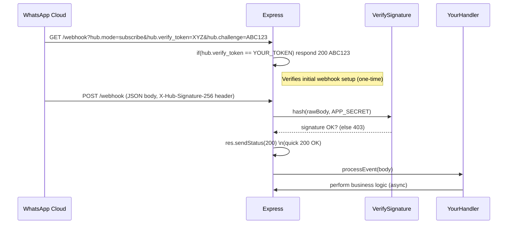

# WhatsApp Cloud API TypeScript/Node.js SDK – In-Depth Guide

**Executive Summary:** We propose building a production-ready TypeScript SDK (an npm package) wrapping the Meta WhatsApp Cloud API. The toolkit should provide clean, promise-based methods for all WhatsApp endpoints (messages, media, templates, etc.), plus utilities (phone normalization, webhook handling, rate limiting, logging, etc.) so developers can integrate WhatsApp rapidly. Key features include a `WhatsAppClient` class with methods like `sendText()`, `sendTemplate()`, `uploadMedia()`, and webhook verification. The library must be well-typed (TypeScript), thoroughly tested, and have excellent documentation and examples. Below we outline a prioritized feature checklist (with effort estimates), project structure and API signatures, security best practices, and comparisons to existing SDKs. We also include diagrams of the architecture and webhook middleware flow.  

## 1. Feature Roadmap & Checklist

- **Core Messaging API (High effort, Maturity milestone):** Implement wrapper methods for all message types:
  - `sendText(phoneNumberId, to, body)`, `sendImage(...)`, `sendDocument(...)`, `sendSticker(...)`, `sendLocation(...)`, `sendContacts(...)`, etc. Internally these `POST /{Phone-ID}/messages` calls mirror Graph API payloads. 
  - **Effort:** Medium – straightforward HTTP calls with well-documented JSON schemas. 
- **Interactive and Template Messages (High effort, Feature milestone):** Support interactive message types (button replies, list messages) and message templates:
  - For **Templates**, add `listTemplates()`, `getTemplate(id)`, `createTemplate(templateData)`, `deleteTemplate(id)` wrapping `/vX.X/{WABA_ID}/message_templates` endpoints. Also helper `sendTemplate(templateName, ...)`.
  - Many existing SDKs **lack full interactive/template support** (see table below). Mark “Template Message Types” as needed (missing in [21]).
  - **Effort:** High – building payload builders and handling the complex JSON for interactive types (see [43]). 
- **Media Management (Medium, Feature milestone):** 
  - `uploadMedia(filePathOrStream, type)` to `POST /{Phone-ID}/media`, returning a media ID. 
  - `getMediaUrl(mediaId)` (`GET /{Phone-ID}/media?media={id}`) and `deleteMedia(mediaId)`.
  - **Effort:** Medium – parse responses, handle file streaming.  
- **Phone Number Utilities (Low, Quick-win):** 
  - Normalize and validate phone numbers to **E.164** format (e.g. “+14155552671”). Use libraries like `libphonenumber-js` or Google’s libphonenumber to add “+” and country code. Example: `formatE164("4155552671", "US") ➞ "+14155552671"`.
  - **Effort:** Low – one utility function wrapper.  
- **Retry/Backoff & Idempotency (Medium, Resilience milestone):** 
  - Implement HTTP retries with exponential backoff on 429/500 (using e.g. `p-retry` or Axios interceptors). Respect `Retry-After` headers from Graph API. 
  - Idempotency: allow an optional `idempotencyKey` in send calls to avoid duplicate sends (store and reuse keys in-flight). 
  - **Effort:** Medium – use libraries or custom token-bucket.  
- **Rate Limiting (Medium, Robustness milestone):** 
  - **Client-side:** Throttle calls (e.g. using a token bucket or `Bottleneck`) per phone number, per docs ~**80 msgs/sec** per number by default. Handle 429 errors by queuing and retrying. 
  - **Distributed (Optional):** Use Redis to share rate counters across Node instances (e.g. a Redis-based token bucket). See typical algorithms (sliding window or Leaky Bucket). 
  - **Effort:** Medium – need a strategy for single vs. multi-instance.  
- **Webhook Handling & Verification (Medium, Foundational milestone):** 
  - **Verification Endpoint:** Express/Fastify middleware for the GET challenge (verify `hub.verify_token`, echo `hub.challenge`). 
  - **Signature Check:** HMAC-SHA256 verify `X-Hub-Signature-256` against the raw body using your App Secret. Example snippet below. 
  - **Parsing & Routing:** Middleware to parse JSON payload and dispatch events (message, status, etc.) to user-defined handlers. Deduplicate using `message.id` (each WhatsApp event has a unique ID). 
  - **Effort:** Medium – straightforward but critical; see snippet.  
- **Logging and Observability (Medium):** 
  - Structured logging (e.g. with `pino` or `winston`), include request IDs, timestamps, log levels. 
  - Metrics: expose counters (messages sent, errors, retries) via Prometheus client. 
  - Tracing: optionally integrate OpenTelemetry to trace API calls. 
  - **Effort:** Medium – add as integration.  
- **TypeScript Types & Payload Models (Medium):** 
  - Provide full TypeScript types for request payloads and response bodies (based on Graph API JSON). 
  - e.g. `SendTextOptions`, `TemplatePayload`, `WebhookPayload` interfaces. 
  - Use code generation (from Graph schema or Postman collection) or hand-write. 
  - **Effort:** Medium – ensure coverage of all message types, keep updated as API evolves.  
- **Error Handling & Typed Errors (Low):** 
  - On non-2xx responses, throw rich error objects containing Graph API error code/message. Example: `WABAErrorAPI` in [11] with `error.message`. 
  - Classify common errors (e.g. `AuthenticationError`, `RateLimitError`). 
  - **Effort:** Low – implement wrapper on fetch/Axios.  
- **Testing (High, Quality milestone):** 
  - **Unit tests:** Mock HTTP (e.g. using `nock`), test each method.
  - **Integration tests:** If possible, use a real or test WhatsApp account to send messages (or Meta’s test phone numbers). 
  - **Sandbox/E2E:** Simulate webhooks and full send->receive flows. 
  - Use Jest or Mocha. 
  - **Effort:** High – crucial for reliability; aim >80% coverage.  
- **Demo/App & README Examples (Low):** 
  - A separate example repo or folder demonstrating common usage (send message, setup webhook). 
  - **Effort:** Low – helps adoption.  
- **CLI Tooling (Optional, Nice-to-have):** 
  - A CLI to initiate a project or test endpoints. E.g. `whatsapp init`, `whatsapp send-text`.
  - **Effort:** Low – bonus (could build later).  

**Priority Order:** 1. **Core messaging + media + templates** (essential). 2. **Webhook + Security** (to receive messages). 3. **Retries & rate limiting** (production-ready). 4. **Types, logging, testing, docs**. 5. **Extras (CLI, advanced features)**.

## 2. Architecture & Middleware Flow

The SDK sits between your application and the WhatsApp Cloud API. Developer code calls `WhatsAppClient` methods, which issue HTTP requests to Meta’s Graph API. Incoming webhooks from Meta hit your server, pass through verification middleware, then dispatch to handlers. Below is a simplified architecture diagram:

```mermaid
graph LR
  App[Developer App] -->|calls| SDK[WhatsAppSDK (TypeScript)]
  SDK -->|Graph API (HTTPS)| MetaAPI[(Meta Graph API)]
  MetaAPI -->|WhatsApp Cloud Platform| WhatsApp[WhatsApp Infrastructure]
  SDK --> Logs[Logging/Monitoring]
  SDK --> Redis[RateLimiter/Queue (Redis)]
  
  MetaAPI -->|webhook (HTTP POST)| WebhookEndpoint[Your Webhook URL]
  WebhookEndpoint -->|verify| SignatureVerifier
  SignatureVerifier -->|parse JSON| EventDispatcher
  EventDispatcher -->|call| App
```

The middleware flow for webhook handling (Express example) is:



In code, signature verification typically looks like:

```ts
import crypto from 'crypto';

function verifySignature(appSecret: string, rawBody: string, signatureHeader: string): boolean {
  const expected = 'sha256=' + crypto
    .createHmac('sha256', appSecret)
    .update(rawBody)
    .digest('hex');
  return signatureHeader === expected;
}

// Usage in Express middleware
app.post('/webhook', express.json({ verify: raw => rawBody = raw }), (req, res) => {
  const sig = req.headers['x-hub-signature-256'] as string || '';
  if (!verifySignature(APP_SECRET, rawBody, sig)) {
    return res.sendStatus(403);
  }
  res.sendStatus(200);
  // Then asynchronously handle req.body...
});
```

Meta **signs each webhook payload** with your App Secret using HMAC-SHA256. Always validate `X-Hub-Signature-256` before processing events. Also dedupe duplicate events by storing each `message.id` (each webhook JSON has a unique `message.id`).

## 3. Project Structure & Example Signatures

A clean project layout might be:

```
my-whatsapp-sdk/
├─ src/
│  ├─ client.ts            # main WhatsAppClient class
│  ├─ messages.ts          # wrapper methods (sendText, sendMedia...)
│  ├─ templates.ts         # listTemplate, sendTemplate, createTemplate...
│  ├─ media.ts             # uploadMedia, getMediaInfo, deleteMedia
│  ├─ phone.ts             # phone number utils (normalizeE164, etc)
│  ├─ webhook.ts           # Express/Fastify middleware, signature verify
│  ├─ rateLimiter.ts       # token bucket / redis logic
│  ├─ logger.ts            # logging setup
│  ├─ errors.ts            # error classes
│  ├─ index.ts             # entry point exporting WhatsAppClient
│  └─ types/               # TypeScript interfaces for payloads
│     ├─ messages.ts
│     ├─ templates.ts
│     ├─ webhooks.ts
│     └─ etc.
├─ tests/                  # unit/integration tests
├─ examples/               # demo code (optional CLI or example usage)
├─ .github/workflows/      # CI (lint, test, build, release)
├─ README.md
├─ package.json
├─ tsconfig.json
└─ .eslintrc, .prettierrc, etc.
```

**Key TypeScript interfaces (examples):**

```ts
interface SendTextOptions {
  phoneNumberId: string;
  to: string;         // E.164 number e.g. "+14155552671"
  text: { body: string };
}

interface MediaUploadResponse { id: string; url?: string; }

interface TemplateComponent {
  type: 'header' | 'body' | 'button';
  // ...
}

interface WebhookEvent {
  entry: Array<{
    changes: Array<{
      value: {
        messages?: Array<{
          id: string;
          from: string;
          timestamp: string;
          text?: { body: string };
          image?: { id: string; mime_type: string };
          document?: { id: string; filename: string };
          // ... other types (interactive, etc.)
        }>;
        statuses?: Array<any>;
      };
    }>;
  }>;
}
```

**Example API method signatures:**

```ts
class WhatsAppClient {
  constructor(config: { accessToken: string; phoneNumberId: string; appSecret: string; });

  // Messaging:
  sendText(opts: SendTextOptions): Promise<any>;
  sendImage(opts: { phoneNumberId: string; to: string; image: { link?: string; id?: string; caption?: string }}): Promise<any>;
  sendDocument(opts: { phoneNumberId: string; to: string; document: { link?: string; id?: string; filename: string; caption?: string }}): Promise<any>;
  sendInteractive(opts: { /* interactive payload */ }): Promise<any>;
  // ... other sendX methods

  // Template management:
  listTemplates(): Promise<any>;
  createTemplate(payload: any): Promise<any>;
  deleteTemplate(templateName: string): Promise<any>;

  // Media:
  uploadMedia(buffer: Buffer, type: string): Promise<MediaUploadResponse>;
  getMedia(mediaId: string): Promise<Buffer>;
  deleteMedia(mediaId: string): Promise<any>;

  // Phone number utils (wrap libphonenumber):
  formatPhone(number: string, region?: string): string;

  // Webhook signature verification:
  verifySignature(rawBody: string, signatureHeader: string): boolean;
  
  // ... possible static middleware factory:
  static expressMiddleware(opts): express.Handler;
}
```

## 4. Comparison: Existing Open-Source WhatsApp SDKs

Below is a summary of five notable OSS Node.js WhatsApp Cloud API SDKs:

| Name (repo)                         | TypeScript | Highlights / Missing                                           | License   |
|-------------------------------------|------------|----------------------------------------------------------------|-----------|
| **Meta Official SDK**<br>[WhatsApp-Nodejs-SDK][3] | Yes (written in TS) | Official by Meta (archived). Supports core send/message/template calls. *Project archived*; lacks updates. No interactive templates or flows. | MPL 2.0 (Meta) |
| **Kapso / whatsapp-cloud-api-js**<br>[gokapso/whatsapp-cloud-api-js][7] | Yes (TS) | Active, mirrors Graph API surface: messages, templates, media, phoneNumbers, flows. Also offers proxies for conversations/contacts. Very full-featured. Missing: only per official API (no obvious gaps). MIT. |
| **WhatsApp Business SDK**<br>[MarcosNicolau/whatsapp-business-sdk][11] | Yes (TS) | Built on Axios, with heavy integration tests. Supports sending all message types (text, image, reaction, etc as shown). Includes a `WebhookClient` helper. Missing: interactive messages (quick replies, lists), and likely template creation (docs don’t list it). MIT. |
| **Great-Detail WhatsApp-JS-SDK**<br>[great-detail/WhatsApp-JS-SDK][21] | Yes (TS) | Actively maintained fork of official SDK. Supports basic API calls. **Missing many features**: interactive messages, list/button templates, flows, phone number mgmt, etc (see TODO list). MIT. |
| **WhatsApp API JS**<br>[Secreto31126/whatsapp-api-js][24][26] | Yes (TS) | Lightweight, zero-deps. Has fluent API with event handlers (e.g. `Whatsapp.on.message`). Supports text, image, document, video, location, contacts, etc, and Mark-as-Read. Missing: template management, flows, and higher-level abstractions. MIT. |

*Sources:* GitHub repos and READMEs. Features are derived from code examples and documentation. All are MIT except the Meta SDK (MPL 2.0).

## 5. Security & Best Practices

- **API Credentials:** Store the WhatsApp **access token** and **App Secret** securely (e.g. in environment variables or a secrets manager). Rotate tokens regularly (use long-lived system user tokens as per Meta’s guidelines).
- **HTTPS:** All API calls and webhooks **must use HTTPS**. Webhook URLs need valid TLS certs.
- **Webhook Verification:** Verify `X-Hub-Signature-256` on every POST using your App Secret. Reject payloads if the signature does not match (code above). This prevents spoofed requests.
- **Origin Validation:** Optionally check `X-Forwarded-For` or source IP against Meta’s ranges (documented by Facebook) to ensure webhooks come from Meta.
- **CSRF Token (hub.verify_token):** For the initial GET handshake, ensure the `hub.verify_token` matches your expected token before echoing back `hub.challenge`.
- **Input Sanitization:** Treat all incoming webhook data (texts, template names, etc.) as untrusted. Use strict type checks and template validation. For interactive replies, only accept known button IDs.
- **Rate Limiting:** Implement client-side throttling. Be careful of the **80 msgs/sec default** (per number) limit and dynamic scaling. Always back off on 429 responses.
- **Idempotency:** Store message IDs or idempotency keys to avoid double-sending if retries occur or webhooks deliver duplicates.
- **Logging:** Redact sensitive info (like phone numbers, tokens) in logs. Use structured logging (JSON) and include context (message IDs, phone IDs).
- **Error Handling:** Catch and log API errors with details. On fatal errors (e.g. credentials invalid), alert operators.
- **Dependencies:** Keep npm dependencies up-to-date to avoid security vulnerabilities. Consider using a scanning tool (e.g. `npm audit`, GitHub Dependabot).

## 6. Testing & CI/CD

- **Unit Tests:** Mock Graph API responses (e.g. with `nock`). Test error cases (400, 429, 5xx) and edge cases (invalid inputs).
- **Integration Tests:** If possible, use a real Meta test app with a sandbox phone. Automate sending a message and receiving the webhook in a test environment.
- **End-to-End (E2E):** Simulate user flow: send message → Meta calls webhook → our handler responds. Tools like Postman or Playwright can script this.
- **CI Pipeline:** Set up GitHub Actions (or similar) to run linting (`eslint`), type-check (`tsc`), tests on each PR. 
- **Versioning & Releases:** Use semantic versioning. Consider semantic-release or GitHub Releases. Tag releases with meaningful notes.

## 7. Packaging & Publishing

- **npm Package:** Define `main` and `types` in `package.json` to your compiled entrypoint. Include a clear `README.md` with examples. The **name** should be scoped (e.g. `@your-org/whatsapp-sdk`). 
- **Documentation:** Publish full docs on GitHub Pages or use TypeDoc. Provide quickstart in README (like connecting token, sending a message).
- **Examples/Demo:** Include an `examples/` folder or separate repo showing a simple Express webhook and a script sending messages.
- **Semantic Versioning:** Follow semver: increment MAJOR for breaking changes, MINOR for new features, PATCH for fixes. Tag releases.
- **CI/CD:** Automate testing and publish to npm on new tags. Protect `main` branch, require PR reviews.
- **Checklist Before Release:** 
  - All tests passing. 
  - README updated. 
  - ChangeLog entry for new version. 
  - License file included. 
  - Keywords and homepage in `package.json`.
  - Validate package contents (no secrets, only necessary files via `.npmignore` or `files`).

## 8. Security Checklist (Summary)

1. **Store secrets** (API tokens, secrets) securely (env vars or vault).  
2. **TLS/HTTPS** everywhere (Graph API, webhooks).  
3. **Verify webhooks** with HMAC-SHA256 signature.  
4. **Verify hub.verify_token** on GET.  
5. **Validate phone numbers** on input (E.164).  
6. **Throttle/Ratelimit** client requests to avoid 429.  
7. **Handle duplicates:** track message IDs to skip repeats.  
8. **Least privilege:** use minimal scopes on tokens. Rotate/regenerate if leaked.  
9. **Keep dependencies updated** to avoid known vulnerabilities.

## 9. Comparison Table of OSS SDKs

| SDK Name                          | Repository                 | TypeScript | Notable Missing Features                                     | License  |
|-----------------------------------|----------------------------|------------|----------------------------------------------------------------|----------|
| **Meta Official SDK**             | [WhatsApp-Nodejs-SDK][3]   | Yes     | Interactive messages, subscription management (archived)       | MPL-2.0  |
| **Kapso SDK**                     | [@kapso/whatsapp-cloud-api][7] | Yes       | (Mirrors Graph API fully)                                      | MIT |
| **WhatsApp Business SDK**<br>*(MarcosNicolau)* | [whatsapp-business-sdk][11] | Yes       | Interactive/list messages, template creation (not documented)  | MIT |
| **WhatsApp-JS-SDK**<br>*(Great Detail)* | [WhatsApp-JS-SDK][21]     | Yes       | Many (interactive, templates, phone mgmt, flows, etc.) | MIT |
| **whatsapp-api-js**<br>*(Secreto31126)* | [whatsapp-api-js][24][26] | Yes       | Templates, flows, extended management (focuses on messaging/events) | MIT |

Sources: GitHub READMEs and code.

## 10. Webhook Verification Snippet

Example Express middleware to verify WhatsApp webhook signatures:

```ts
import express from 'express';
import crypto from 'crypto';

const app = express();
app.use(express.json({
  verify: (req, res, buf) => { (req as any).rawBody = buf.toString(); }
}));

app.get('/webhook', (req, res) => {
  const VERIFY_TOKEN = process.env.WHATSAPP_VERIFY_TOKEN!;
  if (req.query['hub.mode'] === 'subscribe' && req.query['hub.verify_token'] === VERIFY_TOKEN) {
    return res.status(200).send(req.query['hub.challenge']);
  }
  res.sendStatus(403);
});

app.post('/webhook', (req, res) => {
  const rawBody = (req as any).rawBody;
  const signature = req.headers['x-hub-signature-256'] as string || '';
  // Validate signature
  const expected = 'sha256=' + crypto
    .createHmac('sha256', process.env.APP_SECRET!)
    .update(rawBody)
    .digest('hex');
  if (signature !== expected) {
    return res.sendStatus(403);
  }
  res.sendStatus(200); // Acknowledge quickly
  // Now process req.body asynchronously...
});
```
This follows Meta’s guideline: *“Meta signs each webhook payload … using HMAC-SHA256. The signature is in X-Hub-Signature-256.”*.

## 11. Publishing Checklist

Before releasing:

- ✅ **GitHub Repo:**  
  - Public visibility.  
  - `README.md` with install/use examples.  
  - `CHANGELOG.md` or release notes.  
  - `LICENSE` file (MIT or similar).  
  - `.gitignore`, code of conduct, contributing guide, security policy.  

- ✅ **npm Package:**  
  - Unique name (prefer scoped, e.g. `@org/whatsapp-api`).  
  - Set `"main"`, `"module"`, and `"types"` in `package.json`.  
  - Ensure `.npmignore` or `files` includes only build output, not src tests or `.env`.  
  - Include README and license in package.  
  - Use `npm publish` (or CI to publish on release).  

- ✅ **Continuous Integration:**  
  - Action to run tests/lint on push/PR.  
  - Action to build (e.g. tsc) and optionally publish on `vX.Y.Z` tag.  
  - Set up status badges in README (build, coverage).  

- ✅ **Semantic Release:**  
  - Use commit messages (Conventional Commits) to auto-generate CHANGELOG and bump versions.  
  - Tag releases and create GitHub Release notes.  

With these in place, the SDK will be robust, maintainable, and easy for other developers to adopt.

**Sources:** Meta Developer docs and community guides, and popular OSS examples. The above is synthesized from official docs and existing SDKs to ensure completeness.  

